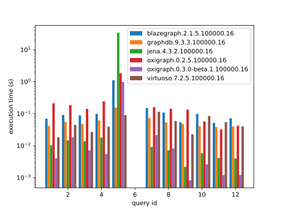
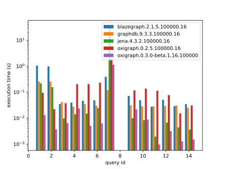

BSBM
====

The [Berlin SPARQL Benchmark (BSBM)](http://wifo5-03.informatik.uni-mannheim.de/bizer/berlinsparqlbenchmark/) is a simple SPARQL benchmark.

It provides a dataset generator and multiple sets of queries grouped by "use cases".

This part of the benchmark suite is based on [Oxigraph](https://github.com/oxigraph/oxigraph)'s benchmarks.

## Results

We compare here Oxigraph 0.2 and 0.3 with some existing SPARQL implementations (Blazegraph, GraphDB, Jena, and Virtuoso).

The dataset used in the following charts is generated with 100k "products" (see [its spec](http://wifo5-03.informatik.uni-mannheim.de/bizer/berlinsparqlbenchmark/spec/Dataset/index.html)). It leads to the creation of 35M triples.
It has been executed on a PrevailPro P3000 with 32GB of RAM.
The tests have been executed with a concurrency factor of 16 (i.e. at most 16 queries are sent at the same time to the server).

Beware, the graph *y* axis is in log scale to properly display on the same graph systems with very different speed behaviors.

### Explore
The [explore use case](http://wifo5-03.informatik.uni-mannheim.de/bizer/berlinsparqlbenchmark/spec/ExploreUseCase/index.html) is composed of 11 queries that do simple data retrieval.

Query 6 existed in previous versions of the benchmark but is now removed.

### Explore and update
The [explore and update use case](http://wifo5-03.informatik.uni-mannheim.de/bizer/berlinsparqlbenchmark/spec/index.html#usecase_explore_and_update) is composed of the 2 operations of the [update use case](http://wifo5-03.informatik.uni-mannheim.de/bizer/berlinsparqlbenchmark/spec/UpdateUseCase/index.html) (`INSERT DATA` and `DELETE WHERE`) and the 11 queries of the [explore use case](http://wifo5-03.informatik.uni-mannheim.de/bizer/berlinsparqlbenchmark/spec/ExploreUseCase/index.html).

The first two elements (1 and 2) are the 2 updates and the others (3 to 14) are the 11 queries.

<!--
### Business Intelligence
The [business intelligence use case](http://wifo5-03.informatik.uni-mannheim.de/bizer/berlinsparqlbenchmark/spec/BusinessIntelligenceUseCase/index.html) is composed of 8 complex analytics queries.

Query 4 seems to be failing on Virtuoso and query 5 on Blazegraph and GraphDB.

Oxigraph is still too slow to evaluate most of the queries.
It will be added to the graph after enough optimizations are done.

-->

## How to reproduce the benchmark

The code of the benchmark is in the `bsbm-tools` submodule. You should pull it with a `git submodule update` before running the benchmark.

To run the benchmark for Oxigraph run `bash bsbm_oxigraph.sh`. It will compile the current Oxigraph code and run the benchmark against it.
You can tweak the number of products in the dataset and the number of concurrent requests using the environment variables at the beginning of `bsbm_oxigraph.sh`.

To generate the plots run `python3 bsbsm-plot.py`.

Scripts are also provided for the other systems (`bsbm_blazegraph.sh`, `bsbm_graphdb.sh`, `bsbm_jena.sh` and `bsbm_virtuoso.sh`).
